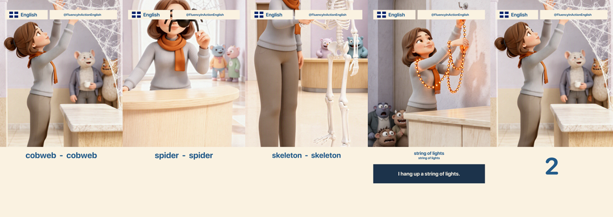

# Measured: the FFmpeg baseline against the performance budget

Prototype for [#6](https://github.com/MBehtemam/Montaget/issues/6), part of the map [#2](https://github.com/MBehtemam/Montaget/issues/2).

**Scope.** This measures **one** pipeline: the incumbent FFmpeg filtergraph. It is the
encode layer underneath Remotion, Revideo, Editly and any headless-Chrome pipeline, so
its numbers **bound** those candidates — but bounding is not selecting. Remotion, DIY
headless Chrome and Skia were scoped out of this run and remain unmeasured. #7 cannot
pick a renderer on this document alone.

**This is a throwaway.** The scripts here exist to produce the numbers below and to be
deleted. Nothing in them is a proposed design — in particular the filtergraph is written
the way the current pipeline writes them, which is the problem Montaget exists to replace.

## Machine

Apple **M1 Pro**, 10 cores, 16 GB, macOS 26.5.2. **ffmpeg 8.0.1** (Homebrew) with
`libx264`, `libass`, `libharfbuzz`, `libfreetype`, `libfontconfig`, `videotoolbox`.
Note **no `libfribidi`**, so `drawtext`'s `text_shaping` is unavailable on this build —
irrelevant here because all text goes through libass, but a portability hazard worth
recording.

Numbers are wall-clock on this machine, as the ticket asked. They are not published
benchmarks and they do not transfer.

## What was rendered

The real fixture, not a synthetic scene: `fixtures/en-halloween-decorating/`.

- **4 stills** (1536×2720) Ken-Burns'd via `zoompan` into the top 1300 px card
- **12 narration placements** from 11 mp3s, positioned on the absolute clock from
  `reference/beats.json`, mixed with `adelay` + `amix`
- **73 subtitle/shape events** — the fixture's 7 per-segment `.ass` files merged onto one
  absolute clock by `build_ass.py`, burned with `libass`: word lines, the two-line hook,
  the sentence on its navy card, the header panels, the drawn flag, the chip and handle
- **1 raster overlay**, the channel badge
- Output **1080×1920 @ 30 fps**, 65.216 s = **1956 frames**

30 fps is the budget's format; the fixture's own published output is ≈25 fps.



Correctness was verified before anything was timed: each segment shows its own image with
its own subtitle, and all 1956 frames are distinct (no held or duplicated frames).

## Results

Median of warm runs. Cold and warm differed by under 5% everywhere — **FFmpeg has
effectively no startup cost**, which is the single most important number for the preview
half of the budget.

### Full render — 65.216 s of output

| Configuration | Wall clock | vs realtime |
| --- | --- | --- |
| filter only, no encode (`-f null`) | 13.00 s | 5.02× |
| **libx264** `-preset medium -crf 23` | **13.13 s** | **4.97×** |
| **h264_videotoolbox** `-b:v 4M` | **12.47 s** | **5.23×** |

**Encode is almost entirely hidden.** Adding libx264 to the filter-only graph costs
0.13 s across 65 s of video. The pipeline is rasterization-bound, and FFmpeg overlaps
encode with filtering across cores.

### Single frame → PNG

| | Cold | Warm |
| --- | --- | --- |
| one frame, full graph, to PNG | 0.97 s | **0.93 s** |

### 10 s preview — and the finding that matters

| Window | Naive `-ss`/`-to` | Graph restructured to the window |
| --- | --- | --- |
| 0–10 s | 2.51 s | **2.19 s** |
| 40–50 s | 9.96 s | **2.29 s** |
| 55–65 s | 12.82 s | **2.23 s** |

**Naive partial render costs time proportional to where the window *starts*, not how long
it is.** A preview of the last 10 seconds costs the same as rendering the entire video.
This is not an FFmpeg flag problem: `-ss` seeks *decoders*, and a synthesised filtergraph
(`zoompan`, `concat`, `color`) has no decoder to seek — it must be evaluated from t=0.

Restructuring the graph to cover only the window makes the cost **flat** — ~2.2 s
wherever the window sits. `window.py` does this: it selects only the overlapping spans,
carries the Ken Burns phase across with a frame offset, re-bases the subtitles onto the
window's local clock, and trims the audio.

The restructured output is **pixel-identical** to the same span of the full render —
verified at t=57, 60 and 64 with lossless encodes, SSIM 1.000000. (Comparing lossy encodes
gives 0.977; that residual is H.264 GOP alignment, not content.)

### Where the time goes

| Variant (identical graph, one filter changed) | Wall clock |
| --- | --- |
| full graph | 13.53 s |
| same graph, `libass` removed | 11.09 s |

All 73 text and shape events cost **2.44 s, ~18%** of the render. Text is not the
bottleneck; the per-frame image resampling is.

### Pure encode floor — 10 s of raw 1080×1920 frames in, MP4 out

| Encoder | Wall clock | vs realtime |
| --- | --- | --- |
| libx264 `-preset veryfast` | 0.57 s | 17.5× |
| libx264 `-preset medium` | 1.51 s | 6.6× |
| h264_videotoolbox | 1.72 s | 5.8× |

**Hardware encode is not faster here.** `h264_videotoolbox` is marginally *slower* than
`libx264 -preset medium` on this content, and 3× slower than `-preset veryfast`. The
encoder-portability worry the budget might have raised does not exist: there is no
Apple-only number to be seduced by, and a portable libx264 build is the fast choice.

## Verdict against the budget

| Budget | Result |
| --- | --- |
| 60 s video renders in under **2 min** | **Met, ~10× over.** 60 s costs ≈12.1 s. |
| 10 s preview renders in under **5 s** | **Met at ~2.2 s — but only if the tool restructures the graph.** Done naively it fails across the back two-thirds of the timeline. |
| Single frame, for agent self-verification | **0.93 s**, and cold ≈ warm. |

## What this means for [#7](https://github.com/MBehtemam/Montaget/issues/7)

1. **The budget is not a constraint on this workload — it is slack.** An FFmpeg backend
   clears the full-render budget by 10×. #7 should choose on expressiveness, licence and
   agent-legibility, and treat speed as a tiebreak rather than a gate.
2. **Partial render is an architectural requirement, not a CLI flag.** Whatever backend
   wins, `--from`/`--to` only stays first-class if the tool builds a graph for the window.
   Any candidate whose range support is "pass a flag to the renderer" should be checked
   for this exact failure — it is invisible until you measure a window that does not start
   at zero.
3. **Startup cost is the real currency of the preview loop, and FFmpeg's is ~0.** Warm and
   cold are within 5%, and a single frame lands in under a second. This is the bar the
   browser pipelines must clear, and it is the one place they are structurally weakest —
   the survey already flagged Chrome boot as the crux. **That comparison is exactly what
   this run did not measure.**
4. **Encoder choice is settled and boring.** Rasterization dominates; encode hides behind
   it; hardware encode is not a win. Use portable libx264.
5. **The pain FFmpeg causes is not performance.** Producing these numbers required merging
   7 `.ass` files onto one clock by hand and hitting a real `zoompan` trap (its `d` is
   frames *per input frame*, so a looped input silently multiplies instead of animating —
   the first render showed one image for all four segments while the subtitles advanced
   correctly). That class of silent, plausible-looking wrongness is the argument for
   Montaget, and it is not a speed argument.

## Reproducing

```
python3 build_ass.py                 # merge the fixture's .ass files onto one clock
python3 measure.py all               # the full matrix
```

`render.py` builds the incumbent-style graph; `window.py` builds the restructured
partial render.
