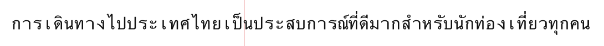
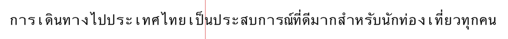
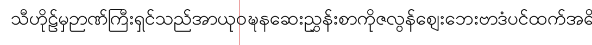

# Rendering Thai through cosmic-text and parley

Resolves [#27](https://github.com/MBehtemam/Montaget/issues/27). Everything
below was run, not read off a manifest. `./run.sh` regenerates all of it.

---

## The headline

**The discriminator is real, and it is bigger than the ticket claimed.**

cosmic-text offers **zero** line-break opportunities in a Thai, Khmer or Lao
paragraph. Not "poor" opportunities — none. So does parley with
`complex-scripts` off; the two stacks are **byte-for-byte identical** on every
sample, which is what you would expect of two crates that both fall back to
UAX #14 with no dictionary. Turning parley's flag on is the only thing in this
prototype that changes any of it.

But the flag is **not free and not perfect**, and both of those are new:

| | cosmic-text 0.19 | parley 0.11, flag off | parley 0.11, flag on |
| --- | --- | --- | --- |
| Thai break opportunities (67-char paragraph) | **0** | **0** | 16 |
| Khmer | **0** | **0** | 11 |
| Lao | **0** | **0** | 12 |
| Japanese / Chinese | 41 / 33 | 41 / 33 | 41 / 33 |
| Latin control | identical | identical | identical |
| Release binary | 2.97 MB | 2.88 MB | **6.70 MB** |
| Process start + layout (min of 40, interleaved) | 230 ms | 86.3 ms | **86.6 ms** |

## What a reader actually sees

`frames/`, all rendered by the same rasterizer into the same 420px box. The red
line is the box edge; ink to the right of it did not fit.

**cosmic-text, `Wrap::Word`** — one line, 1046px wide in a 420px box, 2.5×
overflow. There is no opportunity to break at, so it does not break.

**cosmic-text, `Wrap::WordOrGlyph`** — the paragraph fits, by breaking wherever
it likes. Line 1 ends `เป็`, line 2 opens `น` — the word เป็น is cut in half — and line 2
ends mid-way through นักท่องเที่ยว.

**parley, flag off** — identical to cosmic-text's `Word`: one overflowing line.

**parley, flag on** — three lines, first break after ประเทศไทย.

**parley, flag on, Khmer** — clean.

---

## Answering the ticket's four questions

### 1. Does cosmic-text really produce no break opportunities in a Thai run?

**Yes, and nothing upstream tailors it.** `results/cosmic-opportunities.txt`:
the Thai, Khmer and Lao paragraphs each yield exactly one line start — position
0 — at a 1px box width, where every available opportunity is forced to become a
break. `unicode-linebreak`'s documented `SA → AL` tailoring is what reaches the
frame.

The failure shape is worse than "no breaks", because which of the two failures
you get depends on a wrap setting that has nothing to do with script:

- `Wrap::Word` — the paragraph is one unbreakable 67-character word. It
  overflows the box by 2.5× and, in a video frame, is simply gone off the edge.
- `Wrap::WordOrGlyph` / `Wrap::Glyph` — it fits, by breaking between arbitrary
  grapheme clusters. **This is the silent-and-plausible failure the ticket
  predicted.** The frame looks laid out. It is laid out wrongly, and only a
  Thai reader can tell.

The `thai-with-spaces` sample is the sharpest form of it: Thai puts spaces at
clause boundaries, so cosmic-text finds the 2 spaces, produces 3 tidy-looking
lines, and gets 13 of the 15 boundaries wrong.

### 2. Does parley's flag work at runtime, at what cost, and is icu4x#7218 load-bearing?

**It works.** `diff results/parley-off-Normal.txt results/parley-on-Normal.txt`
is the whole finding: Thai, Khmer and Lao go from one overflowing line to three
fitting ones, and nothing else in the file changes.

**Binary cost: +3.82 MB** (2.88 → 6.70 MB, 2.3×). That is baked ICU4X
dictionary data, and it is the real price.

**Startup cost: none.** 86.3 ms vs 86.6 ms minimum over 40 interleaved runs —
the data is `compiled_data`, static in the binary, so there is nothing to load.
This matters given [#16](https://github.com/MBehtemam/Montaget/issues/16): the
flag does not reopen the startup axis that ticket closed.

**icu4x#7218 is not load-bearing.** The issue is open (`T-bug`,
`C-segmentation`, filed 2025-11-04) and real: the segmenter offers a break
*before* a space as well as after, isolating it. Upstream's own triage —
aethanyc, on the issue — says a layout engine trims trailing spaces so it never
surfaces, and rates it nice-to-have. **parley trims.** The
`khmer-with-spaces` sample uses the issue's own text; swept across 169 box
widths from 60px to 900px, **no line ever starts with a space**
(`results/icu4x-7218-sweep.txt`). It is an upstream wart, not a reason.

**Two corrections to the ticket's premise**, both from reading parley 0.11.1's
source rather than its feature blurb:

- parley calls `LineSegmenter::new_dictionary`, **not** `new_auto`. There is no
  LSTM in this path — it is dictionary data only. The ticket's "`new_auto`
  ships LSTM data" is about a constructor parley does not use.
- The feature's own doc comment says that when disabled, "a lightweight
  segmenter is used that **falls back to character-level breaks** for those
  scripts." That is not what happens. It falls back to *no* breaks — measured
  above, and the reason parley-off overflows its box instead of wrapping
  raggedly. Do not trust that sentence when scoping.

### 3. Does either handle CJK acceptably *without* the flag?

**Yes, and CJK does not discriminate between the two stacks at all.** All three
configurations produce the identical 41 opportunities on the Japanese sample
and the identical 33 on the Chinese one — exactly as UAX #14 class `ID`
predicts, with no dictionary involved.

Better than that: all three also *decline* the two opportunities the word-level
oracle offers before `、` and `。`, so no line begins with trailing punctuation.
Basic kinsoku is already correct everywhere.

The `complex-scripts` blurb lists CJK among the scripts it enables. On this
evidence that is misleading — for line breaking, CJK needs nothing.

### 4. How good is "works", actually?

This is the part the ticket did not ask for and should have. "It breaks Thai"
and "it breaks Thai *correctly*" are different claims, and the author of this
prototype does not read Thai, Khmer or Lao — so the check is against macOS's
own `CFStringTokenizer`, which is neither stack and neither this author
(`results/segmentation-vs-oracle.txt`).

The oracle is a *word* segmenter and the stacks are *line-break* segmenters, so
exact agreement is not required: offering `เด็ก|นักเรียน` inside the oracle's
single word `เด็กนักเรียน` is legitimate. Offering a boundary in the middle of
a word is not.

| Sample | parley + flag vs oracle |
| --- | --- |
| `lao` | **exact match**, 13 for 13 |
| `thai-2` | **superset** — every oracle boundary, plus 3 correct finer ones (`เด็ก\|นักเรียน`, `นัก\|เรียน`, `ภาค\|เรียน`) |
| `thai-3` | **superset** — every oracle boundary, plus 3 correct finer ones (`ช่วย\|เหลือ`, `ผู้\|ประกอบการ`, `ประกอบ\|การ`) |
| `thai-with-spaces` | 2 correct extras (`อาหาร\|ไทย`, `เกิน\|ไป`), nothing wrong |
| `khmer` | 11 of 12, but one shifted: splits `អ្នកទេសចរ\|ណ៍` where the word boundary is `អ្នក\|ទេសចរណ៍` |
| `thai` | **derails.** Correct for the first 8 boundaries, then produces `ดีม\|า\|กสำ\|หรับนั\|กท่` where the words are `ดีมาก\|สำหรับ\|นักท่องเที่ยว` |

So: **four of six clean, one slightly off, one badly wrong.** The `thai` failure
is not mark-stranding — every break still falls on a grapheme-cluster boundary,
so nothing renders broken — but four consecutive words are cut in the wrong
places and a Thai reader would see it.

**This does not change the ranking.** Wrong-in-places beats no-opportunities-at-
all, and it beats a 2.5× box overflow. But it does kill any claim that turning
the flag on makes Thai *solved*, and it means whatever ships needs Thai output
looked at by someone who reads Thai before it is called correct.

---

## Myanmar, and whether cosmic-text can be tailored (issue #129)

Resolves [#129](https://github.com/MBehtemam/Montaget/issues/129), on the same
harness, same `samples.rs`, same rasterizer — two Myanmar samples added
(`myanmar`, unspaced; `myanmar-with-spaces`, the same pangram with a space at
each phrase boundary), family `Myanmar Sangam MN`, and a macOS
CFStringTokenizer (`locale: "my"`) oracle entry added alongside it.

**The same discriminator, and the same cost, to the byte.**

| | cosmic-text 0.19 | parley 0.11, flag off | parley 0.11, flag on |
| --- | --- | --- | --- |
| Myanmar break opportunities (24-syllable-group pangram) | **0** | **0**\* | **22** |
| Release binary | 2.98 MB | 2.90 MB | **6.72 MB** |

\*parley-off's one reported break just isolates the trailing `။` (a `BA`-class
punctuation mark under plain UAX #14); it is not word segmentation — the
282-byte span in front of it is still one unbreakable run.

The binary-size delta is **6,718,496 − 2,898,320 = 3,820,176 bytes — the same
3.82 MB measured for Thai/Khmer/Lao**, because it is the same ICU4X dictionary
data compiled in either way; which sample text is fed through it at runtime
cannot change what got linked. Startup is likewise unchanged (parley
92.6–93.6 ms, cosmic-text 259.7 ms — the same shape as before, cosmic-text's
`fontdb` scan dominating).

**parley's 22 breaks match the macOS oracle exactly, byte for byte**
(`results/segmentation-vs-oracle.txt`): boundaries
`[0, 21, 27, 63, 72, 84, 87, 93, 96, 99, 126, 132, 141, 144, 156, 165, 174,
195, 204, 231, 243, 255, 264, 273, 282]` on both sides. cosmic-text offers 1 of
those 25 (just the string start) — `results/segmentation-vs-oracle.txt`'s own
line: `cosmic-text offered 1 missing [...24 more...] extra []`.

**The frame makes it concrete.** `frames/cosmic-Word-myanmar.png`: one
unbreakable line, cut off mid-syllable by the 420px box. Compare
`frames/parley-on-Normal-myanmar.png`: four clean lines, box-fitting, the same
text.

So Myanmar is not a fourth, separately-priced case — it is the same
`SA → AL` tailoring hitting the same code path, at the same cost, for the same
reason. Nothing about Myanmar specifically discriminates from Thai/Khmer/Lao;
the ticket's premise (unlike Thai/Khmer/Lao, this one was never run) is the
only thing that made it look separate.

**Whether cosmic-text can be tailored: no — there is no hook.** Read from
source rather than measured, because there is nothing to run: `unicode_linebreak::linebreaks(s: &str)`
(`unicode-linebreak` 0.1.5, `src/lib.rs:89`) takes a bare `&str` — no locale,
no dictionary, no callback parameter of any kind, so a caller cannot supply
tailoring data even if `cosmic-text` exposed the call. And it doesn't: `Buffer`'s
only line-break-adjacent surface is `set_wrap` (`Wrap::Word` /
`Glyph` / `WordOrGlyph`), which picks a *fallback strategy* for where to break
when no dictionary opportunity exists — it does not change the opportunity
*set*. The one call site, `ShapeSpan::build` in `cosmic-text-0.19.0/src/shape.rs:970`,
invokes `unicode_linebreak::linebreaks` directly and unconditionally. There is
no escape route: the discriminator does not collapse, for Myanmar or for any
of Thai/Khmer/Lao.

## What this settles for [#7](https://github.com/MBehtemam/Montaget/issues/7)

1. The discriminator survives contact. It is the first thing in
   [ADR-0007](../../../adr/0007-text-runs-literal-size-declared-fonts.md)'s
   "comes free with either stack" list that does **not** come free.
2. It is not a Thai discriminator, it is a **South-East-Asian** one: Thai,
   Khmer and Lao all go from 0 opportunities to working. Myanmar is named in the
   feature and untested here.
3. It costs **3.82 MB of binary and no startup time**. Against
   [#16](https://github.com/MBehtemam/Montaget/issues/16)'s static-musl-binary
   shape, that is a size question, not a performance one.
4. **CJK is not part of it.** Any scoring that credits `complex-scripts` for CJK
   is double-counting.
5. Under [ADR-0003](../../../adr/0003-general-video-editor-not-channel-tooling.md)
   a general editor strangers run meets Thai, so "the fixture has no Thai" is not
   an argument against any of it. **But see the next section before weighting it
   into #7 — whether this discriminator ever fires is now itself an open
   question.**

## The finding that landed after the measurement: does this ever fire?

[ADR-0007](../../../adr/0007-text-runs-literal-size-declared-fonts.md) settles
**"Literal `size`. No fit-to-box. No automatic wrapping"** — a line break is a
`\n` the author placed, and the fixture is already this design (all seven
subtitle files carry ASS `WrapStyle: 2`, *no word wrapping*, every break by
hand). If nothing in Montaget ever wraps text, **the renderer never has to find
a break opportunity in a Thai run, and everything measured above never reaches a
frame.**

That sits directly against the same ADR's other claim, two sections later, that
**"v1 renders bidi reordering, complex-script shaping, per-character font
fallback, and UAX #14 line breaking including CJK"** — and names this fork as
"a live input to [#7](https://github.com/MBehtemam/Montaget/issues/7)". Both
statements are in the accepted ADR. They cannot both be operative.

The measurements above are unaffected: what cosmic-text and parley do is what
they do. What was open was whether it *counts* — and
**[#28](https://github.com/MBehtemam/Montaget/issues/28) has now answered it.**

> **Resolution.** [ADR-0008](../../../adr/0008-line-breaks-belong-to-the-agent.md):
> the renderer never consults a break opportunity; the agent always needs one; they
> are not the same question. **The `SA` fork measured here is an authoring-tool
> requirement, not a renderer criterion** — `measure` gains a break-opportunity
> output, and `icu_segmenter` can be called directly whichever crate renders.
> **For [#7](https://github.com/MBehtemam/Montaget/issues/7): do not weight the
> 3.82 MB discriminator as a renderer criterion.** See also
> [HARD-BREAKS.md](HARD-BREAKS.md), which records a separate parley defect found
> while resolving #28. Note
that "no auto-wrap" does not obviously dispose of it either — an agent placing
`\n` by hand in an unspaced Thai string still has to know where the words are,
and `measure`/`frame` is the only thing that can tell it. That is a tool-surface
question, not a renderer one, and it may move the requirement rather than
delete it.

## What this prototype does not settle

- **Justification, hyphenation, and `word-break`/`overflow-wrap` as *document*
  properties.** The samples pin one wrap mode per run; nothing here says what
  the project file should be able to express.
- **Whether the `thai` derailment is common or rare.** One paragraph in six
  failed. Six paragraphs is not a rate.
- **Font resolution was not held identical.** Each stack ran its own system
  font discovery, and on the Chinese sample cosmic-text resolved to
  `Arial Unicode MS` where the requested family was `Hiragino Sans GB`
  (`resolved-fonts:` in `results/cosmic-*.txt`; parley does not report this).
  It changes glyph widths and therefore where a *given* opportunity is taken —
  it cannot change the opportunity *set*, which is what every claim above rests
  on, and the two stacks agreed on the Chinese breaks anyway. No sample
  produced a `.notdef` glyph in any configuration.
- **macOS only.** ICU4X dictionary data is baked into the binary and platform-
  independent, but font discovery and the oracle are not, and cosmic-text's
  229 ms process time is `fontdb`'s eager system-font scan on *this* machine —
  not a claim about layout speed and not comparable to parley's lazy `fontique`.
