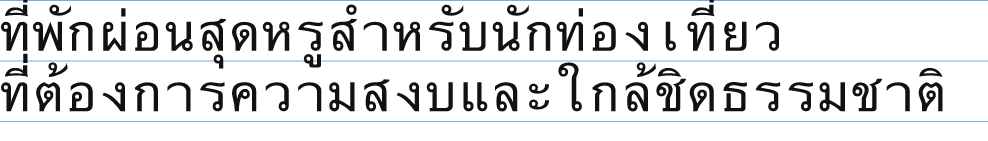
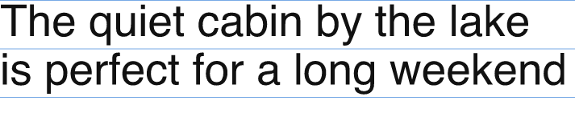

# Thai vertical stacking breaks `line_height`; the box concern is real but different from how the ticket framed it

Resolves [#130](https://github.com/MBehtemam/Montaget/issues/130). Everything
below was run, not read off a manifest. `probe/` regenerates all of it (see
[README.md](README.md)).

---

## The headline

**Both halves of the ticket are confirmed, and the mechanism for each is different from what the ticket guessed.**

1. **`line_height` collides for real, at both tenths values in use.** Two
   real Thai paragraphs, set at the fixture's own size (55px) and both
   `line_height` values seen in the accepted ADRs (1.1 default-in-fixture,
   1.2 default-when-omitted), physically collide between adjacent lines — an
   above-base tone mark or vowel sign on the lower line touches ink from the
   line above it, in the rendered pixels, not just in a metrics comparison.
2. **The box concern is real but is not a margin problem — it is a top-of-block
   clipping problem.** [ADR-0029](../../../adr/0029-line-baseline-half-leading.md)'s
   half-leading formula already uses real font ascent/descent, not the naive
   slot-height split the ticket worried about — but on this font, real glyph
   ink for Thai's above-base marks exceeds the font's own reported ascent, so
   the very first line's marks poke above the top of the block itself,
   independent of any inter-line collision.

## Method

[README.md](README.md) has the full setup. In short: lay a `\n`-delimited Thai
paragraph out one line at a time through parley (`complex-scripts` on), place
each line's baseline with ADR-0029's `baseline_y = slot_centre + (ascent −
descent) / 2`, then take the real min/max-y of every glyph's vector outline
(via `skrifa`) — not the font's advance box, not the nominal slot — and
compare adjacent lines' real ink extents directly. A Latin control at the
identical size and `line_height` runs through the same code, to confirm this
harness reproduces [ADR-0011](../../../adr/0011-tool-surface-reads-checks-renders.md)'s
established "nominal overstates ink" direction for Latin before trusting it on
Thai.

## The numbers

Two-line captions, `size=55`, family `Ayuthaya` (macOS system Thai font):

| `line_height` | slot height | seam ink-to-ink gap | verdict |
| --- | --- | --- | --- |
| 1.1 (fixture default) | 60.5px | **+14.62px overlap** | collides |
| 1.2 (ADR-0007's omitted-field default) | 66.0px | **+9.12px overlap** | still collides |

A third, unspaced three-line Thai paragraph at `line_height=1.1`: the first
seam collides by +14.80px; the second seam clears by −2.87px — close enough
that a slightly heavier tone-mark glyph or a different stacking combination
would collide there too.

The Latin control, same size and `line_height`: seam clears by **−8.69px** (a
real gap, ink does not touch) — confirming the harness reproduces the known-
safe Latin case before the Thai numbers are trusted.

```
line 0: slot=[0.00,60.50]  real ink=[-6.70,68.43]
line 1: slot=[60.50,121.00] real ink=[53.80,111.43]
seam 0/1: line 0 ink bottom=68.43  line 1 ink top=53.80  overlap=14.62  <-- COLLIDES

latin line 0: slot=[0.00,60.50]  real ink=[5.52,56.90]
latin line 1: slot=[60.50,121.00] real ink=[65.59,117.77]
seam 0/1: overlap=-8.69
```

Full numbers: [results.txt](results.txt). Rendered proof, with the nominal
slot boundaries drawn in as blue guide lines so the collision is visible
without trusting the arithmetic:

**Thai, `line_height=1.1`** — line 2's tone marks visibly touch line 1's
below-base vowel signs, inside the blue guide lines.


**Latin control, identical size and `line_height`** — a clean gap between the
two lines.


## Why this happens, and why raising `line_height` doesn't fix it

Thai stacks tone marks (่ ้ ๊ ๋) and some vowel signs above the consonant
base, and other vowel signs below it — both attached by the font's own GPOS
mark-positioning, not drawn as part of the base glyph's normal em-box. A
Latin font's ascent/descent already budgets room for the tallest accented
Latin glyph (Á, ç) because that's what the metric is *for*; Ayuthaya's own
ascent/descent, at least as read here, does not budget the same headroom for
a base-plus-stacked-mark cluster.

Raising `line_height` from 1.1 to 1.2 (+5.5px of slot per line) closes the gap
from +14.62px to +9.12px — real progress, not zero. It would take roughly
`line_height ≈ 1.37` to clear this specific pair by the same −8.69px margin
Latin gets at 1.1, and that number is one sample's worth of evidence, not a
constant — the two- and three-line Thai samples above already disagree by
~5.5px on how much overshoot the worst seam produces, because it depends on
which specific marks land adjacent to which. **There is no single
`line_height` value that is simultaneously "generous enough for Thai" and
"not comically loose for Latin captions", because the two scripts are asking
`line_height` to answer different questions** — Latin's is headroom for rare
tall accents; Thai's is baseline geometry every ordinary sentence uses.

## What this means for the box half of the ticket

The ticket's original framing was about *margin*: "the English sentences sit
well inside their card... a string that passes the check can still look
broken [without margin] in a script that doesn't have that margin." That is
not what the measurement found. [ADR-0014](../../../adr/0014-stroke-is-paint-the-text-box-is-required.md)
already established the box is a container claim with **zero** declared
inset — "fits" means "touches the edge" by design, for every script, and
nothing here argues against that.

What the measurement found instead: **the very first line of a Thai block
pokes ink above the top of the block itself** — `top ink=-6.70 escapes box
top by 6.70` at `line_height=1.1`, `-3.95` at `1.2` — because the half-leading
formula centres the *first* line's slot using the same ascent/descent that
undershoots real ink everywhere else. This is not a margin question at all;
it is the block's own top edge clipping the first line's marks, which would
happen identically whether the box around it has an inset or not — a text
element positioned so its declared block top sits exactly where the caller
expects (e.g. the top of a card) will have its topmost tone mark rendered
outside that boundary.

## What this settles, and what it doesn't

- **The ticket's suspicion is correct in direction, wrong in the specific
  mechanism it named.** It worried about the slot-height formula being
  Latin-tuned; the measured defect is that the font's own ascent/descent
  metrics — which ADR-0029 already reads at render time specifically to avoid
  a Latin-tuned constant — still undershoot real Thai ink. Fixing this is not
  a matter of picking a better `line_height` default; the geometry that would
  need adjusting is either the ascent/descent Montaget reads (e.g. using the
  font's `OS/2` "typo" metrics vs `hhea` metrics, which commonly disagree by
  exactly this kind of margin — not tested here) or accepting that
  `line_height` has a floor that varies by script and font, which the format
  cannot express today.
- **Not settled: whether this generalises past this one font.** Only
  `Ayuthaya` was measured. A different Thai-capable font (Noto Sans Thai,
  the ones a real vendored-font pipeline would actually ship per
  [ADR-0057](../../../adr/0057-font-vendoring-licence-gate-and-path-keyed-attestation.md))
  may report different ascent/descent and change the numbers, possibly past
  the point of colliding at all.
- **Not settled: whether `hhea` vs `OS/2` typo metrics changes this.**
  `skrifa`'s `LineMetrics` (via parley) reports one number; this prototype
  did not compare it against the font's alternate metrics tables.
- **Not settled: Khmer, Lao, Myanmar.** [#27](https://github.com/MBehtemam/Montaget/issues/27)
  found the *line-breaking* discriminator generalises to Khmer and Lao; this
  prototype only measured Thai for the *vertical* question. Khmer in
  particular stacks subscript consonants below the base, which is a different
  geometry than Thai's above/below vowel-and-tone-mark stacking and may
  behave differently.
- **Not a schema change by itself.** Nothing here requires a new field —
  `line_height` is already authored, and the defect is in how the renderer
  computes ascent/descent from it, or in accepting that some `(font, size,
  line_height)` combinations are legitimately too tight for the script being
  set. Whether `validate` should be able to say so, and from what input, is
  a design question this prototype does not answer.
